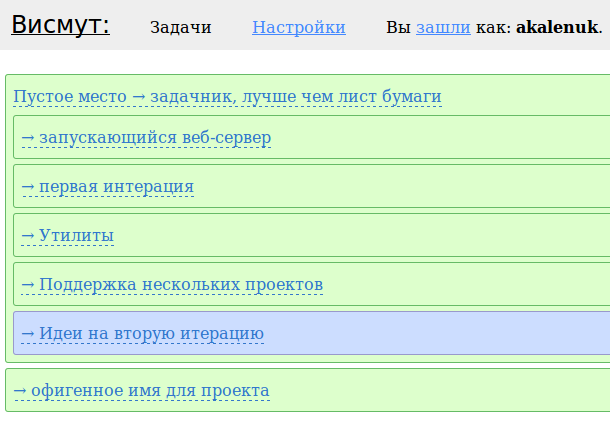

bismut
======

Веб-инструмент для декомпозиции задач: проектирования, планирования, трекинга и т. п. 

Технически это сайт для «<a href="http://nitrogenproject.com/">Нитрогена</a>». Для того, чтобы запустить «Висмут» локально, надо поставить сам «Нитроген», поместить сорцы в site/ и запустить веб-сервер согласно инструкции.

Для того, чтобы создавать висмут-задачники нужен либо инвайт, либо кодовая фраза вместо него. Фраза захардкожена в индексе, сейчас она пишется: "Мне можно и без инвайта." (обязательно с точкой). Инвайты - это просто пустые файлы, лежащие в папке "data/invite_list/". Инвайт используется - файл удаляется.

Да, еще одно. Весь CRUD сделан через файловую систему. То есть каждая запись в "базу" - это файл. Если хотите использовать эту штуку не как модель, а как реальный задачник на много людей, обязательно надо будет прикрутить к salode нормальную базу. Любой key-value storage подойдет.

Но вообще администрировать данные в виде файлов очень удобно. Ветку туда, векту сюда - отлично же! Так что если толпы пользователей не ожидается, можно оставить как есть.

Исходный код отдается по лицензии Apache 2.0. Если коротко: делайте с ним, что хотите, а я ни за что не отвечаю.
