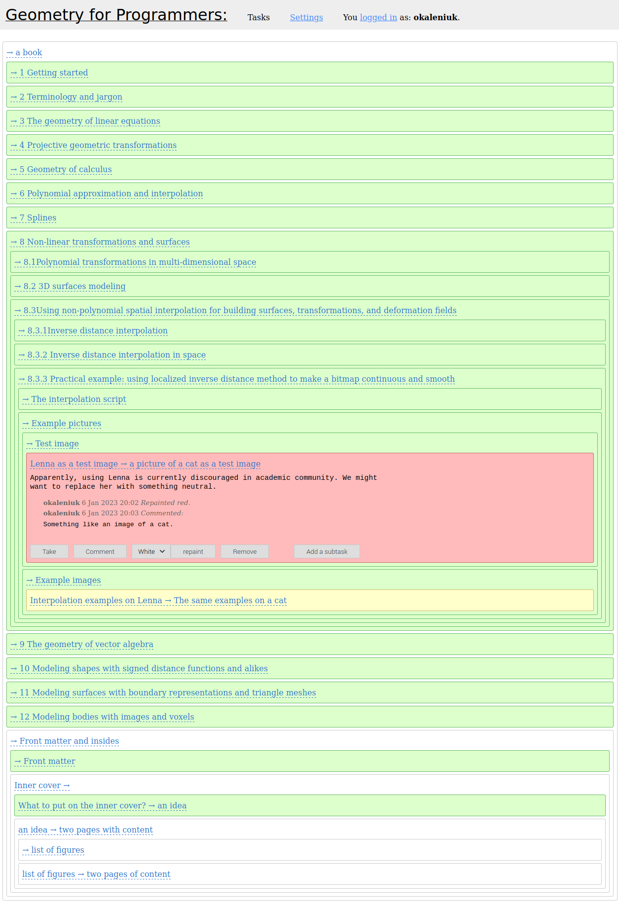

Bismut
======
This is a hierarchical colored work tracker. Like a traditional bug/task tracker but with multicolored hierarchical items so your whole project looks a bit like a bismuth crystal, and you can see its status immediately just by looking at the tasks at hand. 

*By David Abercrombie, [CC BY-SA 2.0](https://creativecommons.org/licenses/by-sa/2.0), via Wikimedia Commons*

If you get the concept but want to suggest a feature or a bug fix, contact me at: akalenuk@gmail.ua.

An example
----------
I'm currently writing a book called [Geometry for Programmers](https://www.manning.com/books/geometry-for-programmers). Tons of work, hundreds of tasks and bugs. However, even now, when the book is almost finished, my project board looks quite readable. In fact, this is the whole board:

Most of the chapters are finished so they are green and folded. There are multiple tasks in them but since they don't bother me at the moment, they are hidden inside the large tasks which are chapters. Except for one.

As it turns out, while I was writing the book, the scientific community decided not to use [Lenna](https://en.wikipedia.org/wiki/Lenna) as a testing image anymore. I was not aware of that so I used Lenna in my book to demonstrate smooth image scaling and now I have to redo all the figures involved. This counts as a bug.

In Bismut, bugs are not segregated from tasks except semantically. If you have something and you want something else, whatever you call it, a "bug" or a "user story", it needs work. So every bug-like task has a current or "before" state, and a desired or "after" state. The task for the work you want is then written with an arrow:

    Lenna as a test image → a picture of a cat as a test image
    
This task is red since it is a blocker, I have to get it done before I can move to anything else. As soon as the problem is solved, and I get my picture of a cat instead of Lenna, I'll rerun the scripts that showcase the interpolation and generate the interpolation examples images. I did that before with Lenna, so the generation task per se is green. However since a new issue occurred since then, and the task needs more work now, I added a new sub-task and painted only one new task yellow. This is intentional.

With hierarchical items, I don't have to repaint the whole tree, I just keep it open and paint the branches that need attention on the exact level they do.

The white items at the bottom are the ones I haven't got to yet. Since they don't have a state "before" they all start with an arrow. They are not yet folded they just don't have a lot of items in them yet. I don't have to plan in detail before I start working. As soon as new issues occur, I'll simply add them as subtasks.

Of course, this tool only fits a particular style of project management. But it serves me well, and I'm not pushing it on anyone else.

How to run
----------
The source code is licensed under Apache 2.0. TL&DR: you do whatever you want, I don't take any responsibility.

This is a «Nitrogen» site. To run your own instance, download Nitrogen, put the sources into the site/ folder, and run the Nitrogen node by running

    bin/nitrogen console

The site will appear at

    http://127.0.0.1:8000

Disclaimer
----------
This is a prototype, a proof of concept. It uses a file system as a key/value storage and even keeps passwords unhashed and unsalted. If you want to use it for anything other than toying with, at the very minimum, you have to patch these things up first.
